# Event Scheduling & Resource Allocation System

A Flask-based web application for managing events and allocating resources with conflict detection and utilization reporting.

## Features

- **Event Management**: Create, edit, view, and delete events
- **Resource Management**: Add and manage resources (rooms, instructors, equipment)
- **Resource Allocation**: Allocate resources to events with conflict prevention
- **Conflict Detection**: Automatic detection of double-bookings and time overlaps
- **Utilization Reports**: Generate resource utilization reports with metrics
- **User-Friendly UI**: Clean, responsive interface with Bootstrap 5
- **Real-time Validation**: Client-side and server-side validation

## Screenshots

### Home Page (Part 1)
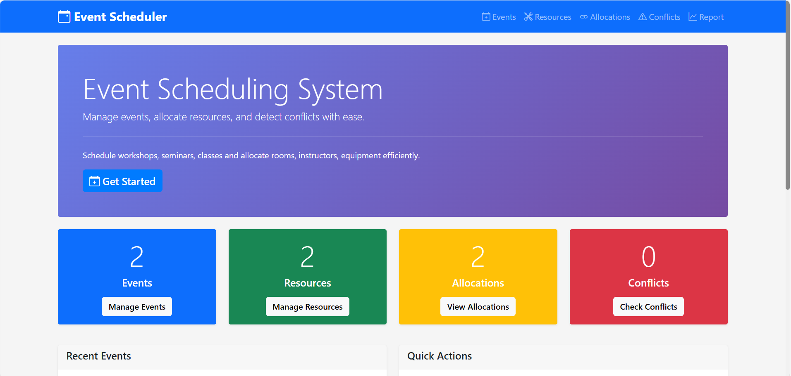

### Home Page (Part 2)
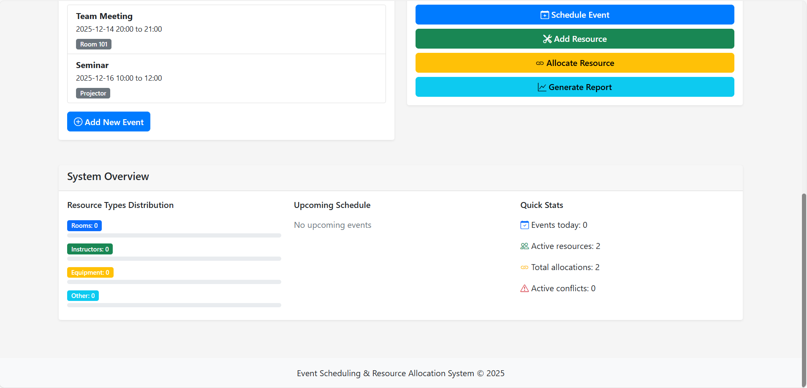

---

### Event Management
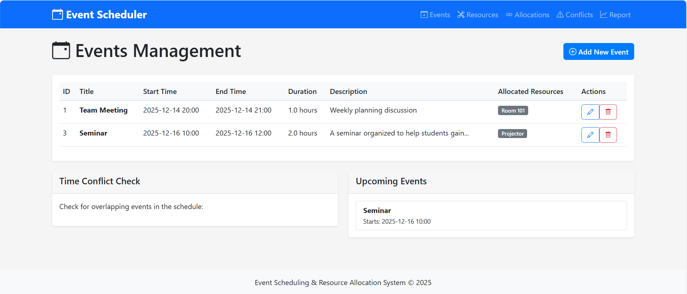

---

### Add Event
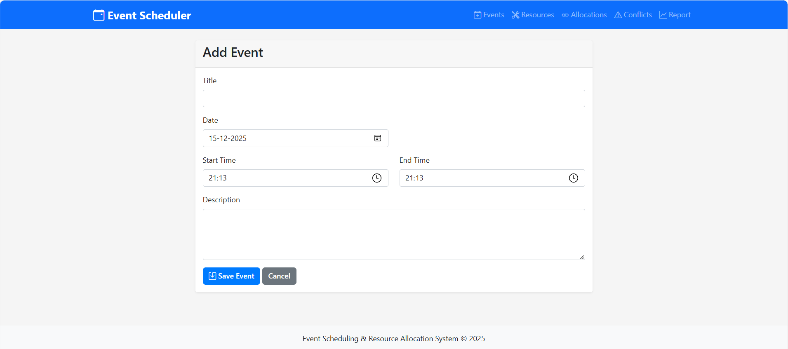

---

### Resource Management
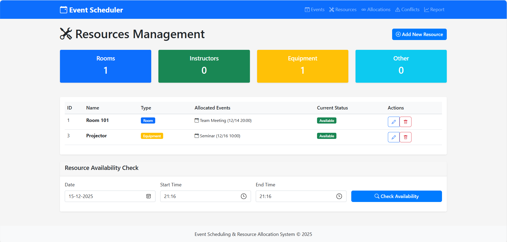

---

### Add Resource
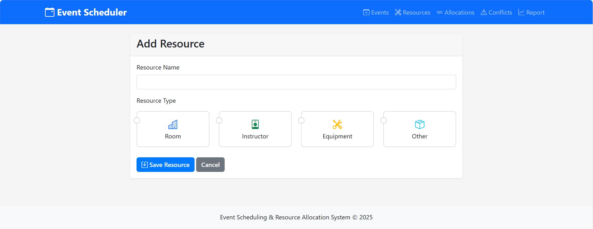

---

### Resource Allocation
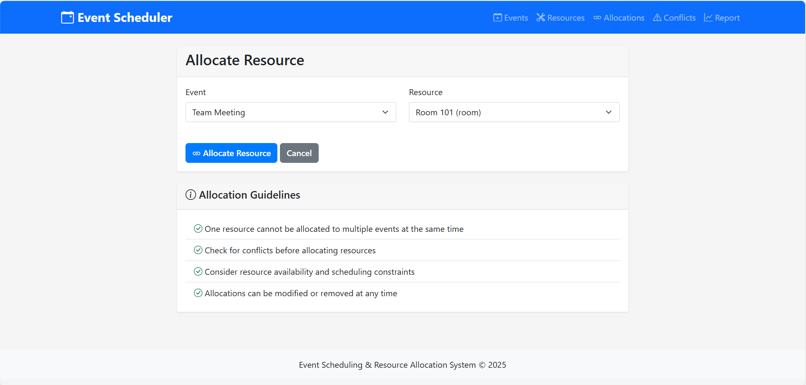

---

### Resource Allocations List
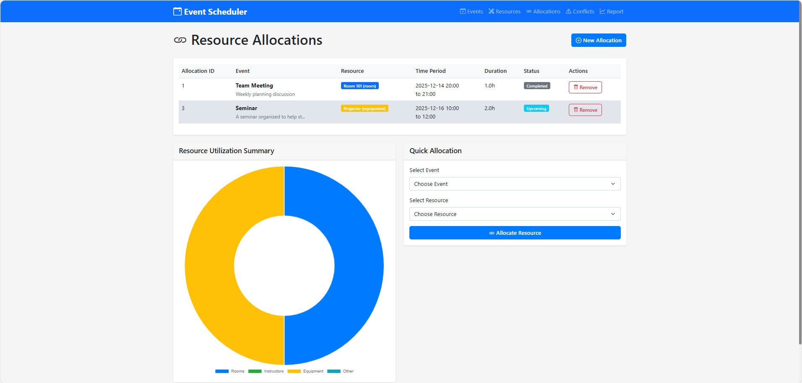

---

### Conflict Detection
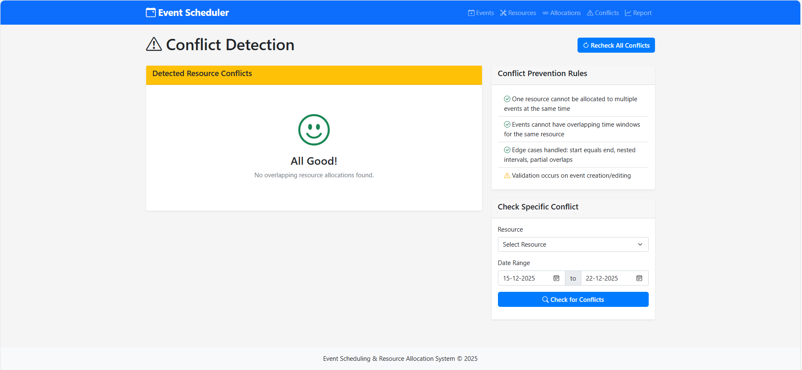

---

### Utilization Report (Part 1)
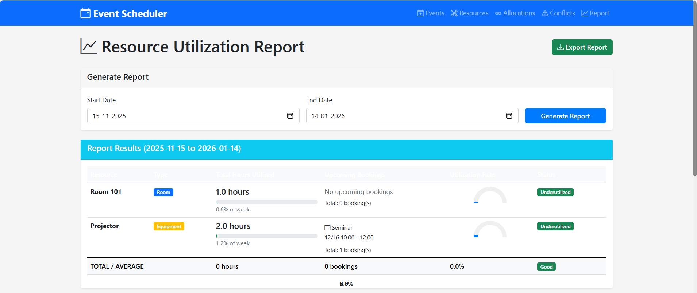

### Utilization Report (Part 2)
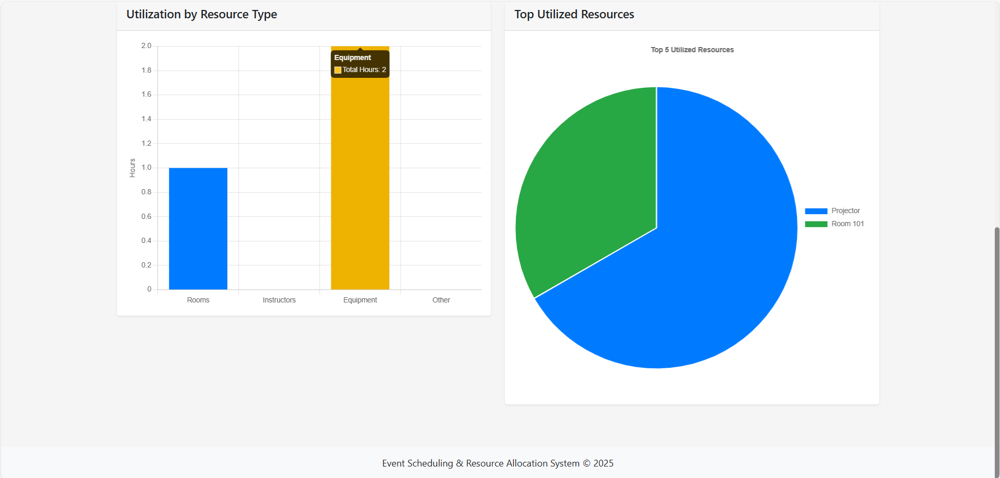


## Demo Video 

🎥 Screen-recorded video showing all screens and reports:  
[Click here to watch the demo video](https://drive.google.com/file/d/1gmnZSA0lXykc38HjlrbIVXpmoIBUIxac/view?usp=sharing)

## Installation

1. Clone the repository:
```bash
git clone <repository-url>
cd event_scheduler